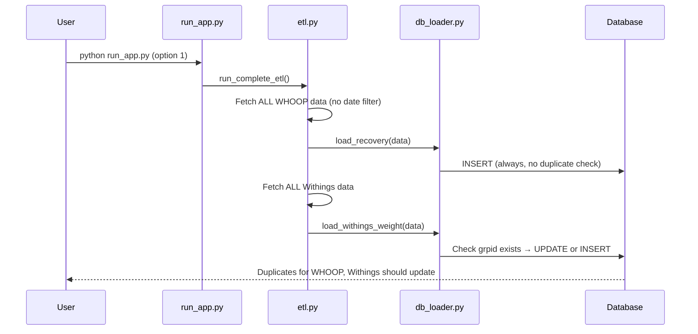
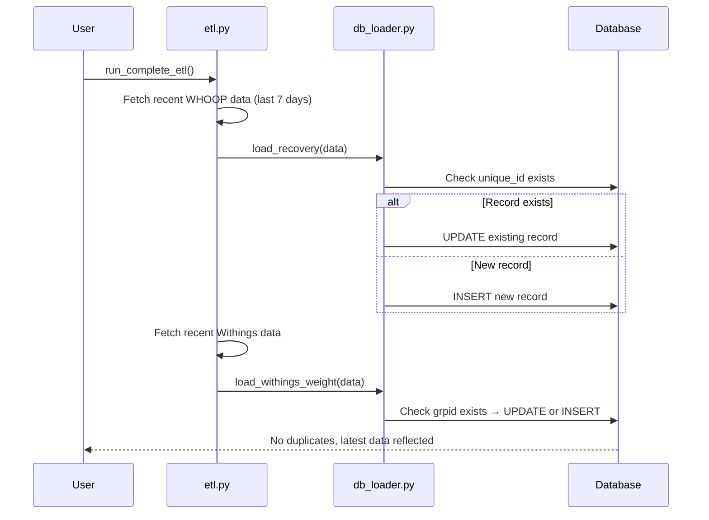

# Fix ETL Data Loading Issues (v1.1.1)
## Background
The WHOOP Data Platform ETL pipeline currently performs full data loads on every run, causing duplicate records in the database. Additionally, Withings weight data does not appear to update when running the ETL, despite having upsert logic in place.
The current implementation creates duplicates for WHOOP data (recovery, workout, sleep) because it lacks duplicate checking. This resulted in 2,992 duplicate recovery records that required manual cleanup. For Withings data, the upsert logic exists but new weight measurements are not reflected after ETL runs.
## Problems
* WHOOP data (recovery, workout, sleep) creates duplicate records on every ETL run
* Withings weight data does not update despite having upsert logic
* ETL always fetches ALL historical data, making runs inefficient
* No way to do incremental updates for recent data only
* Database grows with duplicates requiring manual cleanup
## Current State
### ETL Flow

### WHOOP Loader (Broken)
* load_recovery(): Always INSERT, no duplicate check
* load_workout(): Always INSERT, no duplicate check  
* load_sleep(): Always INSERT, no duplicate check
* Issue: cycle_id exists in models but is a ForeignKey to cycles table, not the WHOOP API unique ID
* Need to identify unique identifiers from WHOOP API response
### Withings Loader (Has Upsert)
* load_withings_weight(): Checks if grpid + user_id exists → UPDATE or INSERT
* load_withings_heart_rate(): Checks if grpid + user_id exists → UPDATE or INSERT
* Uses grpid as unique identifier from Withings API
* Upsert logic is correct, but new data not appearing (need to debug why)
### Root Causes
1. **WHOOP duplicates**: No unique identifier check before insert
2. **Withings not updating**: Upsert logic exists but either (a) API not returning new data, (b) authentication issue, or (c) logic not executing
3. **No incremental loading**: ETL fetches all historical data every time
## Hypothesis
If we implement upsert logic for WHOOP data and debug the Withings update issue, then:
* WHOOP data will update instead of duplicating
* Withings weight will reflect current measurements
* ETL can run repeatedly without manual cleanup
* (Optional) Incremental loading will make ETL faster and more efficient
## Project Overview
This is a **v1.1.1 patch release** that fixes data loading bugs and improves ETL efficiency.
### What We'll Fix
1. **WHOOP Upsert**: Add duplicate checking using unique API identifiers
2. **Withings Debug**: Investigate why new weight data doesn't appear
3. **Incremental Loading (Optional)**: Fetch only recent data instead of full history
### Expected Flow After Fix

## User Stories
* **As a developer**, I want the ETL to update existing records instead of creating duplicates, so that the database stays clean.
* **As a user**, I want my latest weight from Withings to appear in the dashboard, so that I can track my progress.
* **As a platform maintainer**, I want the ETL to run efficiently with incremental updates, so that data loads are fast.
## Implementation Steps
1. Debug Withings data loading (verify API response and authentication)
2. Identify unique identifiers from WHOOP API responses
3. Add upsert logic to load_recovery(), load_workout(), load_sleep()
4. (Optional) Add incremental loading with startdate/enddate parameters
5. Test full ETL pipeline prevents duplicates
6. Verify dashboard reflects updated Withings weight
7. Commit with proper conventional commit messages (fix:, feat:)
8. Create v1.1.1 release tag and GitHub release
## Metrics
* Number of duplicate records after ETL run (should be 0)
* Withings weight update time delta (should match API timestamp)
* ETL execution time (should decrease with incremental loading)
## Open Questions
* What are the unique identifiers in WHOOP API responses? (need to inspect API data)
* Why is Withings upsert logic not updating records? (need API debugging)
* Should incremental loading be default or configurable? (suggest last 7 days default)
* Do we need to preserve full historical data on first run? (yes, only incremental on subsequent runs)
