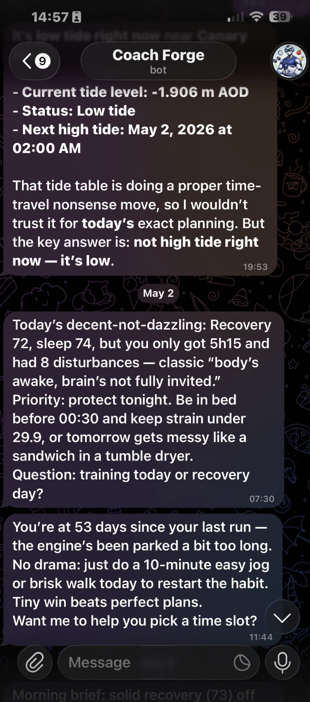
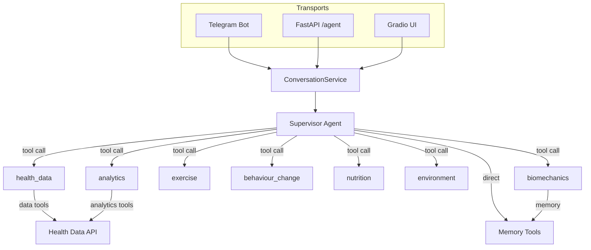

# Personal Health Coaching Agent

[](https://www.python.org/downloads/)
[](https://github.com/astral-sh/uv)
[](https://opensource.org/licenses/MIT)
[](https://gitcgr.com/ald0405/whoop-data)


> A multi-agent AI system that turns fragmented wearable data into a personalised,
> conversational wellness companion — so the question shifts from *"what happened to my
> body?"* to *"what's one thing worth doing about it today?"*

It connects WHOOP and Withings data behind a LangGraph agent that retrieves, analyses,
remembers, and coaches across recovery, sleep, training, and nutrition — reachable by chat,
API, and Telegram, and capable of analysing a workout video for movement form.

---

## The problem

Wearables generate an enormous amount of personal health data, but the everyday experience
is still poor:

- **Dashboards answer "what happened," not "what now."** A recovery score of 42% is a number,
  not a next step.
- **The data is siloed.** WHOOP holds recovery, sleep, and strain; Withings holds weight and
  body composition. Nothing synthesises them into one picture.
- **There's no memory and no timing.** Generic apps don't remember your goal, your injury, or
  what you committed to last week — and they surface insight when you open the app, not when
  it would actually change a decision.

This project is a personal exploration of what closing that gap looks like: a single coaching
surface that synthesises the data, remembers context across sessions, and reaches out at the
right moment.

## What it does

- **Conversational coaching across domains** — ask about recovery, sleep, training load,
  body composition, or nutrition in natural language and get a synthesised, actionable answer
  rather than a raw chart.
- **Proactive, time-aware nudges (JITAI)** — a just-in-time evaluator surfaces a relevant
  prompt inside a daily window (e.g. a morning briefing, a "hidden load" stress check, an
  activity-gap reminder) with cooldowns so it informs without nagging.
- **Movement-form feedback from video** — send a short clip of a tennis serve or a gym lift
  and it runs local pose analysis, computes joint angles per rep, and returns annotated frames
  (colour-coded skeleton + ideal-form "ghost" overlay) with plain-language cues.
- **Longitudinal memory** — it durably remembers your profile, goals, constraints,
  commitments, and its own observations, so coaching compounds over weeks instead of resetting
  each chat.
- **Interpretable analytics** — trend, driver-importance, and correlation analysis explain
  *why* a metric moved (e.g. how deep sleep and HRV relate to next-day recovery), not just a
  black-box prediction.
- **Meets you where you are** — the same coaching brain is reachable through a web chat UI, a
  REST API, and a Telegram bot, all sharing one conversation and memory layer.

## See it in action



A real Telegram session with the coach (here named *Coach Forge*). Three distinct
capabilities in one thread: **environment context** (live tide times for outdoor planning),
a **proactive morning briefing** that reads recovery, sleep duration, and disturbances and
proposes one priority, and an **activity-adherence nudge** that noticed a 53-day running gap
and offered a small, restart-the-habit action — each delivered in a consistent coaching voice.

## Key product decisions

The interesting work here is less the code and more the judgement calls. A few worth calling
out:

- **Supervisor + specialists, not one mega-prompt.** A routing supervisor delegates to seven
  scoped specialists (each with a curated tool set and domain prompt). This keeps each
  reasoning step focused, makes routing debuggable, and lets cost/quality be tuned per
  specialist — at the cost of some orchestration overhead, which is the right trade for answer
  quality.
- **Interpretable models over black-box accuracy.** Driver analysis uses ordinary-least-squares
  regression with labelled, human-readable coefficients. For a self-coaching loop, *being able
  to explain why* matters more than squeezing out marginal predictive accuracy.
- **Proactive by design, with guardrails.** The JITAI evaluator respects local-time windows
  and layered cooldowns (global, per-intent, post-morning). A proactive coach that annoys you
  gets muted, so restraint is a product requirement, not a nicety.
- **Memory as explicit categories.** Durable memory is split into `profile`, `goal`,
  `constraint`, `commitment`, and `observation`. Structuring memory by intent makes retrieval
  relevant and keeps the coach grounded in *your* situation over time.

## How it works

A supervisor agent receives every message and routes it to the right specialist(s), then
synthesises the result in a consistent coaching voice. Specialists are wrapped as tools, so
the supervisor decides *who* answers while always owning the final response.



**The seven specialists**

| Specialist | What it owns |
|---|---|
| `health_data` | Retrieves WHOOP recovery/sleep/workouts and Withings weight/body composition |
| `analytics` | Driver-importance (OLS/MLR), correlations, trend and pattern detection, predictions |
| `exercise` | Progressive-overload and periodisation guidance (FITT-VP) |
| `behaviour_change` | Adherence, motivation, and habit support (COM-B framework) |
| `nutrition` | Protein/macro guidance grounded in current body metrics |
| `environment` | Weather, air quality, transport, and outdoor-timing context |
| `biomechanics` | Video movement analysis (MediaPipe pose) for serve/lift form |

The video path is a three-stage pipeline — dense local pose analysis (up to 600 frames,
33 landmarks per frame) → structured metrics passed to a vision-capable agent → supervisor
synthesis with coaching tone and health context. Conversation state and long-term memory are
backed by Postgres (with an in-memory fallback for development), so threads and memory survive
restarts and are shared across every transport.

> Architecture deep-dive, module map, and prompt design: [`whoopdata/agent/README.md`](whoopdata/agent/README.md).
> The platform is ~27k lines across ~109 Python modules with ~30 test suites.

## Tech stack

Python 3.10+ · [LangGraph](https://github.com/langchain-ai/langgraph) ·
[FastAPI](https://fastapi.tiangolo.com/) · OpenAI · [MediaPipe](https://developers.google.com/mediapipe)
pose estimation · statsmodels / scikit-learn · Postgres · [Gradio](https://www.gradio.app/) ·
Telegram · [UV](https://github.com/astral-sh/uv).

## Intended purpose & scope

This is a **personal wellness and self-reflection tool — not a medical device.** It is a
single-user personal project that surfaces informational insight from a person's own wearable
data to support general lifestyle and fitness reflection. It does **not** diagnose, treat,
monitor, or manage any medical condition, and its outputs are not clinical advice or clinical
decision support. Anything health-related that matters should be taken to a qualified
professional.

## Quick start

### 1. Install UV and dependencies

```bash
curl -LsSf https://astral.sh/uv/install.sh | sh
uv sync
```

### 2. Configure environment variables

Create a `.env` file with your API credentials:

```bash
WHOOP_CLIENT_ID=your_whoop_client_id
WHOOP_CLIENT_SECRET=your_whoop_client_secret
WITHINGS_CLIENT_ID=your_withings_client_id
WITHINGS_CLIENT_SECRET=your_withings_client_secret
WITHINGS_CALLBACK_URL=http://localhost:8766/callback
OPENAI_API_KEY=your_openai_api_key
```

Per-agent model behaviour (model, temperature, retries, reasoning effort) is configured in
`whoopdata/agent/settings.py` via `LLM_CONFIG` as the single source of truth. WHOOP uses
OAuth 2.0 browser authentication; on first ingestion you may be redirected to complete the
authorization-code flow.

### 3. Ingest, serve, and chat

```bash
make etl       # incremental ingestion (use `make etl-full` for a full historical backfill)
make server    # FastAPI server exposing the data, insights, and agent surfaces
make chat      # Gradio chat UI at http://localhost:7860
```

API docs are served at `http://localhost:8000/docs` (Swagger) and `/redoc` (ReDoc).

> **Going further** — shared Postgres memory, the Telegram bot, always-on macOS services,
> proactive-nudge smoke tests, the full command reference, and troubleshooting all live in the
> [Operations & Setup guide](docs/guides/OPERATIONS.md).

## Public surface model

The API is organised into canonical namespaces:

- **`data`** — raw health records and provider status under `/api/v1/data/*`
- **`insights`** — derived dashboards, analytics, scenarios, plans, and reports under `/api/v1/insights/*`
- **`agent`** — conversational/coaching requests under `/api/v1/agent/*`
- **`web`** — human-facing pages at `/dashboard`, `/analytics`, and `/report`

WHOOP developer integrations target the WHOOP **v2** API; the app's own `/api/v1/*` versioning
is internal namespacing, separate from the upstream WHOOP API version.

## Documentation

Documentation is organised in [`docs/`](docs/README.md):

- [`docs/guides/`](docs/guides/) — operations/setup, testing, and contribution workflow
- [`docs/features/`](docs/features/) — feature specs and product behaviour
- [`docs/technical/`](docs/technical/) — API changes, migration notes, implementation detail
- [`whoopdata/agent/README.md`](whoopdata/agent/README.md) — agent architecture deep-dive

## Acknowledgements

The multiple linear regression module was inspired by
[idossha/whoop-insights](https://github.com/idossha/whoop-insights/blob/main/src/whoop_sync/mlr.py).

## License

MIT License. See [LICENSE](LICENSE) for details.
