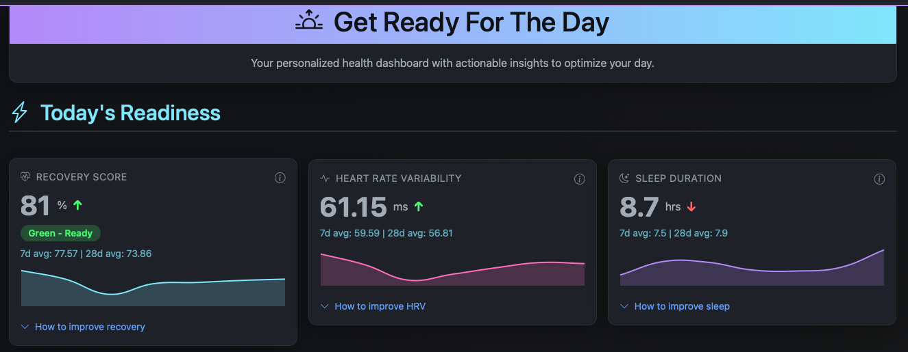

# WHOOP Health Data Platform

[](https://www.python.org/downloads/)
[](https://github.com/astral-sh/uv)
[](https://opensource.org/licenses/MIT)




This project is a personal health intelligence system that consolidates data from WHOOP and Withings into a single analysis layer. It helps quantify how sleep, training, recovery, body composition, and behaviour interact, so you can move from raw device data to interpretable insights, API-accessible metrics, and conversational exploration. Beyond personal biometrics, it adds environmental and operational context—such as weather forecasts, air quality, tidal conditions, and public transport status—so the platform can support better day-of decisions about outdoor training, route choice, and activity planning

## What it does

- **Data Integration** -- ETL pipelines for WHOOP (recovery, sleep, workouts, cycles) and Withings (weight, body composition, heart rate)
- **REST API** -- FastAPI backend with interactive Swagger docs
- **Analytics Pipeline** -- Trend analysis, correlation analysis, and multiple linear regression models for recovery and HRV
- **Chat Agent** -- LangGraph-based agent for natural language queries against your health data
- **Dashboard** -- Web UI with charts, MLR coefficient tables, partial correlation charts, and correlation heatmaps

## Public Surface Model

- **`data`** -- Raw health records, context resources, and provider status under `/api/v1/data/*`
- **`insights`** -- Derived dashboards, analytics, scenarios, plans, and reports under `/api/v1/insights/*`
- **`agent`** -- Conversational/coaching requests under `/api/v1/agent/*`
- **`web`** -- Human-facing pages at `/dashboard`, `/analytics`, and `/report`

New integrations should target the canonical namespaces above. Legacy aliases still exist in a few places as temporary compatibility adapters during the migration.

WHOOP developer integrations in this repository target the WHOOP **v2** API. The app's own route versioning under `/api/v1/*` is internal product/API namespacing and is separate from the upstream WHOOP developer API version.

## Quick Start

### 1. Install UV and Dependencies

```bash
# Install UV package manager
curl -LsSf https://astral.sh/uv/install.sh | sh

# Install all dependencies (creates .venv automatically)
uv sync
```

### 2. Set up Environment Variables

Create a `.env` file with your API credentials:

```bash
# WHOOP OAuth 2.0
WHOOP_CLIENT_ID=your_whoop_client_id
WHOOP_CLIENT_SECRET=your_whoop_client_secret

# Withings OAuth
WITHINGS_CLIENT_ID=your_withings_client_id
WITHINGS_CLIENT_SECRET=your_withings_client_secret
WITHINGS_CALLBACK_URL=http://localhost:8766/callback

# OpenAI (required for the chat agent)
OPENAI_API_KEY=your_openai_api_key
```

WHOOP uses OAuth 2.0 browser authentication -- you will be redirected to log in through their website when first running the ETL. Some WHOOP developer apps do not allow the `client_credentials` grant; in that case the local clients in this repo fall back to the browser-based authorization-code flow.
### 3. Ingest Data

```bash
make etl
# or, for a full historical backfill:
make etl-full
```

These are the canonical ingestion commands. `make run` is still available as a convenience launcher, but it mixes ETL and server startup in one interactive flow.

### 4. Start the API

```bash
make server
```

The API server exposes the canonical `data`, `insights`, and `agent` surfaces.

### 5. Run Analytics (optional)

```bash
make analytics
```

Use this when you want to materialize the analytics/insights workflows ahead of time.

### 6. Start the Chat Interface (optional)

```bash
make chat
```

Chat UI runs at http://localhost:7860. You can ask questions like:
- "Show me my tennis workouts from 2025"
- "What's my weight trend over the last 30 days?"
- "How has my recovery been this month?"
### 7. Start LangGraph Dev Tooling (optional, development-only)

```bash
make langgraph-dev
```

This is for development/debugging workflows. It is not a separate product surface and should not be treated as the public agent API.

### 8. Access the API

- **Swagger UI**: http://localhost:8000/docs
- **ReDoc**: http://localhost:8000/redoc
- **OpenAPI tags**: `data`, `insights`, and `agent`

## Canonical Run Modes

### Primary Commands

- `make etl` -- Canonical incremental ingestion command
- `make etl-full` -- Canonical full-history ingestion command
- `make server` -- Canonical FastAPI server for the `data`, `insights`, and `agent` surfaces
- `make chat` -- Canonical Gradio chat UI backed by the shared conversation boundary
- `make analytics` -- Canonical analytics materialization command
- `make langgraph-dev` -- Development-only LangGraph tooling
- `uv run whoop-withings-auth` -- Canonical Withings re-auth utility

### Convenience Launchers

- `make run` / `uv run whoop-start` -- Interactive launcher that combines ETL and server flows
- `uv run python start_health_chat.py` -- Convenience helper that starts the API server and chat UI together
- `make dev-all` -- Combined FastAPI + LangGraph dev helper

Use the primary commands for docs, automation, and repeatable workflows. Treat the convenience launchers as shortcuts rather than the canonical product entrypoints.

## Rollout Verification Checklist

1. Run the focused validation slices for the migration work before cutting over.
2. Start the API with `make server` and confirm `/docs` shows the `data`, `insights`, and `agent` OpenAPI tags.
3. Smoke the canonical public flows:
   - `GET /api/v1/data/recovery`
   - `GET /api/v1/insights/dashboard/daily`
   - `POST /api/v1/agent/conversations`
   - `POST /api/v1/agent/messages`
4. Smoke representative compatibility adapters such as `/workouts/latest`, `/recovery/latest`, `/dashboard/daily`, and `/api/daily-plan`, and confirm the `Deprecation`, `Sunset`, and `X-Canonical-Route` headers advertise the canonical replacement.
5. Launch `make chat`, send an initial message, then send a follow-up message and confirm the conversation resumes cleanly instead of starting a new thread.
6. Keep `make langgraph-dev` scoped to development/debugging workflows rather than rollout verification of the public product surface.

## Make Commands

```
Setup:
  make install        Install production dependencies
  make dev            Install with dev dependencies
  make sync           Sync/update dependencies

Run:
  make run            Convenience launcher (interactive ETL + server menu)
  make server         Primary FastAPI server command
  make etl            Primary ETL pipeline (incremental)
  make etl-full       Primary ETL pipeline (full load)
  make chat           Primary chat interface command
  make analytics      Primary analytics pipeline command
  make langgraph-dev  Development-only LangGraph dev server
  make dev-all        Convenience FastAPI + LangGraph dev launcher

Development:
  make test           Run tests with pytest
  make test-cov       Run tests with coverage report
  make format         Format code with black
  make lint           Lint with flake8
  make typecheck      Type check with mypy
  make verify         Run system verification

Maintenance:
  make clean          Clean cache files and build artifacts
  make clean-all      Clean everything including .venv
```

## Troubleshooting

- **WHOOP 401 errors** -- Delete `.whoop_tokens.json` and re-authenticate
- **Withings re-auth** -- Run `uv run whoop-withings-auth`
- **Looking for the right API?** -- Use `/api/v1/data/*` for raw records, `/api/v1/insights/*` for interpreted outputs, and `/api/v1/agent/*` for conversational requests
- See [docs/technical/](docs/technical/) for detailed guides

## Documentation

Documentation is in the [`docs/`](docs/README.md) directory:

- [Technical Documentation](docs/technical/) -- Development logs, API changes, troubleshooting
- [Features Documentation](docs/features/) -- Feature specs and configuration

## Acknowledgements

The multiple linear regression module was inspired by [idossha/whoop-insights](https://github.com/idossha/whoop-insights/blob/main/src/whoop_sync/mlr.py).

## License

MIT License. See [LICENSE](LICENSE) for details.
