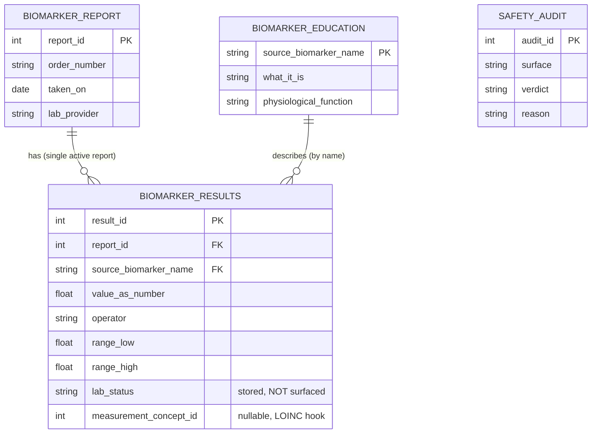

# Biomarker Analyser — Database Schema

> Tables live in the existing `whoopdata/database/whoop.db` (added additively via the shared
> SQLAlchemy `Base` in `whoopdata/models/models.py`). Diagram shows PKs, FKs, and a few representative
> fields — not every column. Keep in sync with the model classes.
> See [`BIOMARKER_INTENDED_PURPOSE.md`](BIOMARKER_INTENDED_PURPOSE.md).

## Notes

- **`biomarker_report`** holds exactly one active report. Seeding is **truncate-and-load** (scoped to
  the biomarker tables only), so the DB never expresses two timepoints → longitudinal monitoring is
  structurally impossible.
- **`biomarker_results`** is **OMOP `MEASUREMENT`-shaped** (`value_as_number`, `value_as_concept`,
  `operator`, `unit`, `range_low/high`) with nullable `measurement_concept_id` / `unit_concept_id` as
  LOINC/UCUM hooks for a later OMOP export. No vocabulary mapping in Phase 0.
- **`lab_status`** stores the lab's own verdict for audit only — CRUD/tools never select it.
- **`safety_audit`** is standalone (logs every output; no FK).
