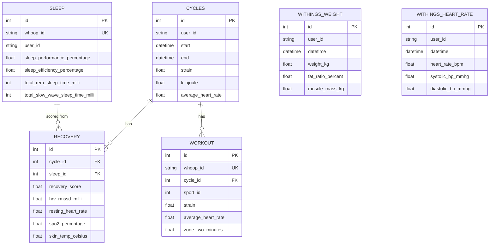

# Database Schema

This project uses **two databases**, each with a distinct job. Diagrams below show primary keys,
foreign keys, and a few representative fields per table -- not every column. The source of truth for
the SQLite schema is the SQLAlchemy models in `whoopdata/models/models.py`; keep this document in sync
when those models change.

## The two databases

| Database | Where | Holds |
|---|---|---|
| **SQLite** | `whoopdata/database/whoop.db` (engine in `whoopdata/database/database.py`) | All domain and application data: WHOOP, Withings, the daily engine, the proactive-message log, and the biomarker tables. Defined by the shared SQLAlchemy `Base`. |
| **PostgreSQL** | Docker container `whoop-agent-postgres`, database `whoop_agent`, port 5432 (see `docker-compose.yml`) | The LangGraph **agent persistence** layer only -- conversation state and long-term memory. Built in `whoopdata/agent/persistence.py`. |

### How the Postgres (agent persistence) database is used

`whoopdata/agent/persistence.py` provisions two LangGraph resources against `AGENT_POSTGRES_URL`:

- **Checkpointer** (`AsyncPostgresSaver`) -- persists conversation/thread state so a Telegram or UI
  conversation can resume across messages, keyed by `thread_id`.
- **Long-term memory store** (`AsyncPostgresStore`) -- backs the `search_memory` / `manage_memory`
  tools (`whoopdata/agent/memory_tools.py`). Memories are namespaced per user and **category**:
  `profile`, `goal`, `constraint`, `commitment`, `observation`.

Notes:

- If `AGENT_POSTGRES_URL` is not set, persistence falls back to in-memory
  (`InMemorySaver` / `InMemoryStore`) and nothing survives a restart.
- The tables in this database are created and managed by LangGraph itself (via `.setup()`), not by our
  SQLAlchemy models, so they are not drawn below.
- On retrieval, `search_memory` passes a natural-language `query` to the store. True vector-*semantic*
  ranking requires an embeddings index to be configured on the store; `persistence.py` does not set
  one today, so retrieval is currently scoped by user and category rather than by semantic similarity.
  Adding an embeddings index to `AsyncPostgresStore` would make it semantic.

## SQLite: WHOOP and Withings data

### Relationships and joins

- `recovery.cycle_id -> cycles.id` and `recovery.sleep_id -> sleep.id`: each recovery score belongs to
  one WHOOP cycle and is scored from one sleep.
- `workout.cycle_id -> cycles.id`: each workout belongs to one cycle.
- `sleep.whoop_id` and `workout.whoop_id` are unique WHOOP API identifiers.
- `withings_weight` and `withings_heart_rate` have **no database-level foreign keys**. They are
  independent measurement streams from the Withings scale/device and relate to the WHOOP data only
  logically, by `user_id` and timestamp.

## Other tables in the same SQLite database

These live in `whoop.db` alongside the data above but are derived or operational rather than raw
device data:

- `recommendations` (PK `id`) and `recommendation_outcomes` (PK `id`, FK `recommendation_id -> recommendations.id`)
  -- daily-engine recommendations and whether they were followed.
- `proactive_message_log` (PK `id`) -- log of proactive (JITAI) nudges, used to apply cooldowns and
  escalation.
- `biomarker_report`, `biomarker_results`, `biomarker_education`, `safety_audit` -- the biomarker
  analyser tables, documented separately in
  [`../features/BIOMARKER_SCHEMA.md`](../features/BIOMARKER_SCHEMA.md).
