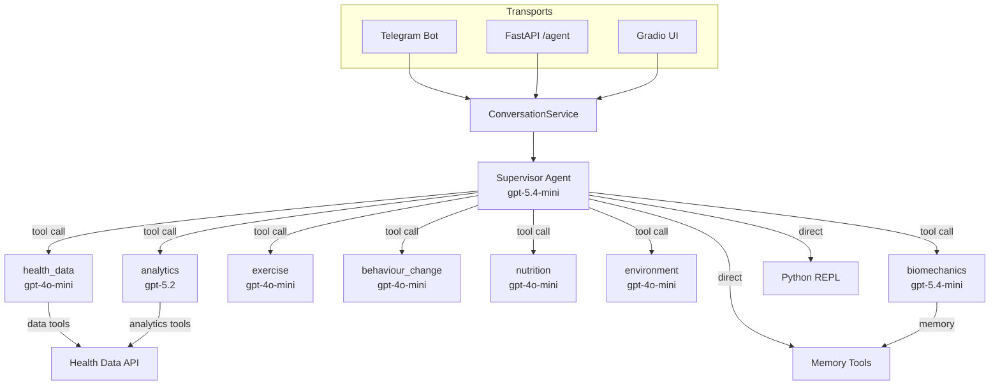
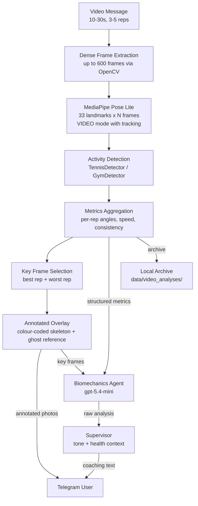

# Agent Architecture

This package implements the conversational health coaching agent. It uses a
**supervisor-specialist** pattern built on LangGraph's `create_agent`, where a
single supervisor delegates domain-specific work to specialist subagents
wrapped as tools.

## High-Level Architecture

The supervisor always produces the final user-facing response. Specialists
return their output to the supervisor, which synthesises it with the
appropriate coaching tone and any cross-domain context.

## Video Pipeline

Video messages follow a three-stage pipeline: dense local pose analysis,
LLM interpretation, and supervisor synthesis.

**Stage 1: Dense local analysis** -- MediaPipe Pose Lite processes up to
600 frames in `VIDEO` mode with temporal tracking. Joint angles are computed
per frame via NumPy. Activity-specific detectors (wrist/shoulder speed for
tennis, knee angle valleys for squats) find individual reps. Metrics are
aggregated across reps: mean angles, consistency (SD), fatigue drift.

**Stage 2: LLM interpretation** -- The biomechanics agent receives
structured metrics (actual numbers, not pixel-eyeballing) plus 2-3
annotated key frames with colour-coded skeletons and ghost reference
overlays.

**Stage 3: Supervisor synthesis** -- The supervisor wraps the analysis in
coaching tone, cross-references health data, and maintains thread
continuity.

**User output:** Annotated photos (colour-coded skeleton + dashed blue
ghost showing ideal pose) followed by concise coaching text. All frames,
metrics, and landmarks saved locally for review.

For text-based follow-ups ("what drills fix that hip rotation?"), the
supervisor routes to the `biomechanics` specialist tool registered in the
agent registry, which can both search durable memory and pull workout
context (tennis and general workout tools) for grounded recommendations.

## Module Map

| Module | Responsibility |
|---|---|
| `settings.py` | All configuration: `LLM_CONFIG` per-agent model settings, API keys, proactive coach thresholds |
| `registry.py` | `AGENT_REGISTRY` -- specialist name, description (routing signal), system prompt, and tool list |
| `graph.py` | Assembles the supervisor graph via `create_agent` with specialist tools |
| `specialists.py` | Builds each registry entry into a `create_agent` instance wrapped as a `StructuredTool` |
| `biomechanics.py` | Standalone biomechanics agent for the video path (not wrapped as a supervisor tool) |
| `pose_analysis.py` | Local MediaPipe pose detection, angle computation, activity detection, metrics aggregation |
| `pose_overlay.py` | Colour-coded skeleton drawing, ghost reference overlay, form diff annotation |
| `video_archive.py` | Saves raw frames, annotated photos, metrics JSON, and landmarks to local archive |
| `conversation_service.py` | Public conversation boundary -- resolves sessions/threads, builds messages, invokes the graph |
| `model_config_loader.py` | Validates and normalises `LLM_CONFIG` entries |
| `model_factory.py` | Builds `init_chat_model` instances from validated config |
| `memory_tools.py` | `search_memory` and `manage_memory` tools backed by LangGraph's store |
| `persistence.py` | Checkpointer and store initialisation (Postgres or in-memory) |
| `prompts.py` | Loads the supervisor system prompt from `data/prompts/agents/supervisor.md` |
| `schemas.py` | `HealthAgentState`, `HealthContextSchema`, `AgentConfig` |
| `public_response.py` | Response contract: `AgentConversationResponse`, artifact extraction |
| `tools.py` | All domain tools (health data, analytics, environment, etc.) |
| `nodes.py` | Legacy node implementations (predates the `create_agent` migration) |

## Configuration

All model assignments live in `settings.LLM_CONFIG`. Each entry specifies:

- `provider` -- currently `"openai"` only
- `model` -- the model identifier (e.g. `gpt-5.4-mini`, `gpt-4o-mini`)
- `temperature`, `max_output_tokens`, `timeout_seconds`, `max_retries`
- `reasoning_effort` (optional) -- for models that support it

The `specialist_default` entry is the fallback for any specialist not
explicitly listed. To override a specialist's model, add or edit its named
entry in `LLM_CONFIG`.

Current routing consistency policy aligns specialist temperatures to `0.1`
to reduce variance in equivalent query paths.

## Routing Ownership Notes

- Protein/macro/dietary guidance routes through the `nutrition` specialist.
- The supervisor does not directly call the protein recommendation tool.
- `health_data` focuses on metric retrieval/summaries; `behaviour_change`
  focuses on adherence/motivation coaching.

## Tool Surface (High-Level)

The tool layer is intentionally broad, but it is organized into clear domains
so routing stays understandable:

- **Health data retrieval tools** -- WHOOP and Withings record access
  (recovery, sleep, workouts, body metrics, heart-rate/vitals, and summaries).
- **Analytics tools** -- deeper analysis and modeling utilities
  (factor importance, correlations, trends, and prediction endpoints).
- **Environment/context tools** -- weather, air quality, forecast, transport,
  tide, and outdoor planning context.
- **Coaching support tools** -- nutrition/protein recommendation logic and
  specialist-specific plan-generation support.
- **Memory tools** -- durable coaching memory:
  - `search_memory` for retrieving relevant user context
  - `manage_memory` for create/update/delete of durable facts
- **Computation tool** -- Python interpreter for custom calculations and
  chart generation when structured analysis is needed.

Design intent:
- Specialists receive domain-scoped subsets of these tools from
  `whoopdata/agent/registry.py`.
- The supervisor gets specialist wrappers plus a small set of direct tools
  (Python interpreter + memory tools) for orchestration and synthesis.
## Memory

The agent uses LangGraph's store abstraction for durable memory. Categories:

- `profile` -- stable user facts (weight, age, equipment)
- `goal` -- user objectives
- `constraint` -- injuries, time limitations
- `commitment` -- agreed plans
- `observation` -- agent-noted patterns, including biomechanics analysis summaries

Memory is namespaced per user (`memory/{user_id}/{category}`) and persists
across sessions via Postgres (or in-memory for development).

## Prompt Files

System prompts for specialists that need longer instructions live in
`data/prompts/agents/`:

- `supervisor.md` -- the main supervisor personality and routing instructions
- `exercise_sub_agent.md` -- FITT-VP framework, experience-level categorisation
- `behaviour_change_sub_agent.md` -- COM-B framework, BCT techniques
- `biomechanics_sub_agent.md` -- gold-standard reference ranges (tennis serve,
  squat, deadlift), analysis output format, coaching cue guidelines
