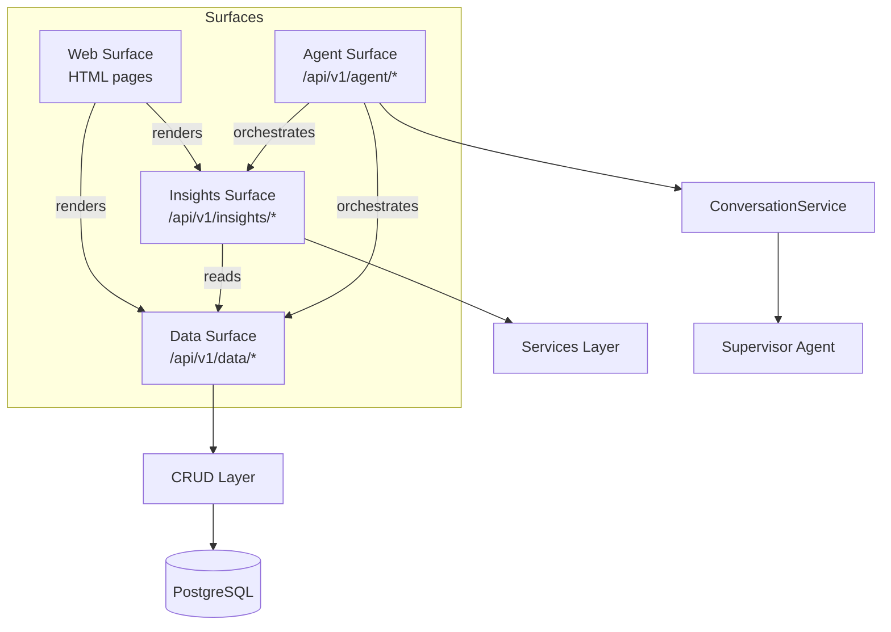

# API

FastAPI application providing the HTTP surface for the health data platform.
Routes are organised into four canonical surfaces, each with distinct
ownership rules.

## Surface Architecture

## Canonical Surfaces

| Surface | Prefix | Purpose | Ownership |
|---|---|---|---|
| **Data** | `/api/v1/data/` | Raw health data access -- recovery, sleep, workouts, weight, weather, transport, tides | Returns stored or fetched data without interpretation. No LLM calls. |
| **Insights** | `/api/v1/insights/` | Interpreted outputs -- analytics, daily briefings, dashboard summaries, recovery actionability | May call services that run ML predictions or aggregate data. |
| **Agent** | `/api/v1/agent/` | Conversational interface -- send messages, start conversations, manage sessions | Routes through `ConversationService` to the supervisor agent. |
| **Web** | `/` (root) | HTML dashboard pages served via Jinja2 templates | Consumes data and insights surfaces for rendering. |

## Module Map

| Module | Responsibility |
|---|---|
| `app_factory.py` | `create_app()` -- assembles the FastAPI instance, registers routers in surface order, configures CORS and OpenAPI metadata |
| `public_surface_contract.py` | Defines `CanonicalSurface` types, ownership rules, and the contract enforced across all routes |
| `public_surface_inventory.py` | Data-only migration inventory of all routes and entrypoints with their target canonical paths |
| `legacy_route_deprecation.py` | Middleware that serves deprecation headers on legacy route aliases during migration |
| `agent_routes.py` | Agent surface endpoints: `/agent/conversations`, `/agent/messages` |
| `recovery_routes.py` | Recovery data (`/data/recovery`) and insights (`/insights/recovery`) |
| `sleep_routes.py` | Sleep data endpoints |
| `workout_routes.py` | Workout data and insights endpoints |
| `withings_routes.py` | Withings weight/body composition data and insights |
| `withings_status_routes.py` | Withings connection status |
| `weather_routes.py` | Weather data from OpenWeatherMap |
| `transport_routes.py` | TfL transport status |
| `tide_routes.py` | Thames tide times and insights |
| `analytics_routes.py` | ML-powered analytics insights (correlations, predictions, patterns) |
| `daily_routes.py` | Daily coaching briefing insights |
| `dashboard_routes.py` | Dashboard aggregate insights |
| `dashboard_page_routes.py` | HTML dashboard page routes |
| `web_routes.py` | Root web pages |

## Route Naming Convention

Each domain (recovery, sleep, workout, etc.) typically has:

- A **data router** at `/api/v1/data/{domain}/...` -- raw data access
- An **insights router** at `/api/v1/insights/{domain}/...` -- interpreted outputs
- A **legacy router** preserving old paths during migration, with deprecation headers

## Legacy Migration

The codebase is migrating from flat route paths (e.g. `/recovery`) to the
canonical surface namespaces (`/api/v1/data/recovery`). During this
transition:

- Legacy aliases remain functional but return `Deprecation` headers
- `public_surface_inventory.py` tracks every route's migration status
- `legacy_route_deprecation.py` adds the deprecation middleware

Once all consumers have migrated, legacy aliases will be removed.
