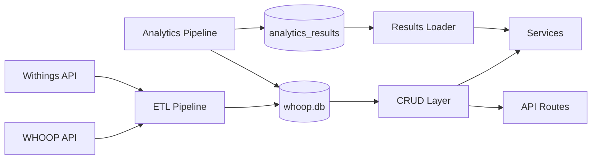
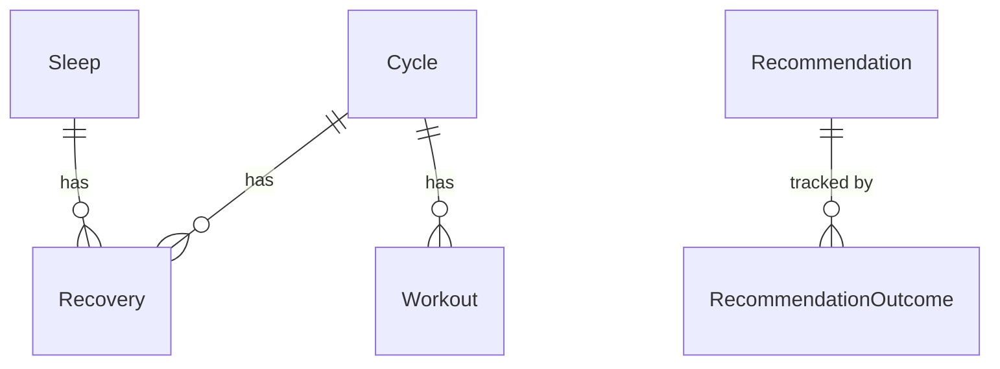

# Database

Database configuration, connection management, and schema definitions.
The platform uses two separate persistence layers:

1. **SQLite** (`whoop.db`) -- primary store for health data (WHOOP, Withings)
   and pre-computed analytics results. Managed by SQLAlchemy.
2. **PostgreSQL** (optional) -- agent conversation checkpointing and durable
   memory store. Managed by LangGraph's persistence layer (see
   `agent/persistence.py`).

## Module Map

| Module | Responsibility |
|---|---|
| `database.py` | SQLAlchemy engine and session factory. Creates the SQLite engine at `database/whoop.db`, exposes `SessionLocal` for session creation and `get_db()` as a FastAPI dependency. |
| `analytics_schema.py` | Creates the `analytics_results` table for storing pre-computed ML insights. Uses raw `sqlite3` rather than SQLAlchemy because the table stores JSON blobs that do not map to an ORM model. |

## Data Flow



## Session Management

The `get_db()` generator is the standard way to obtain a database session in
FastAPI request handlers:

```python
from fastapi import Depends
from whoopdata.database.database import get_db

@router.get("/example")
def example(db: Session = Depends(get_db)):
    ...
```

For scripts and background tasks that run outside the request lifecycle, use
`SessionLocal()` directly and ensure you close it:

```python
from whoopdata.database.database import SessionLocal

db = SessionLocal()
try:
    ...
finally:
    db.close()
```

## Schema Overview

The database contains two groups of tables:

**Health data tables** (defined in `models/models.py`, populated by ETL):



- **Cycle** is the central entity -- one per physiological day
- **Recovery** joins to both Cycle and Sleep (recovery is computed from the
  previous night's sleep within the current cycle)
- **Workout** joins to Cycle; sport type is an integer ID
  (see `utils/sport_mapping.py`)
- **WithingsWeight**, **WithingsHeartRate** -- standalone, no FK joins to
  WHOOP tables
- **Recommendation** / **RecommendationOutcome** -- tracks daily engine
  suggestions and whether they were followed
- **ProactiveMessageLog** -- standalone, tracks sent nudges for cooldown logic

See `models/README.md` for the full model summary with key fields and join
paths.

**Analytics results table** (managed by `analytics_schema.py`):

- `analytics_results` -- stores pre-computed JSON payloads keyed by
  `(result_type, days_back)`. Not an ORM model; accessed via raw sqlite3
  through `analytics/results_loader.py`.

## Notes

- The SQLite database file lives at `whoopdata/database/whoop.db`. It is
  created automatically on first ETL run.
- WHOOP IDs are stored as strings; integer PKs are auto-generated locally.
- Withings timestamps arrive as Unix integers and are converted to
  `datetime` during ETL.
