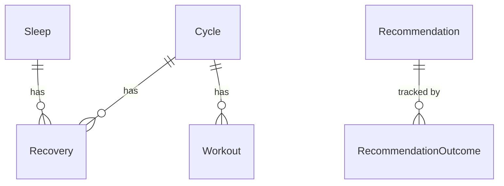

# Models

SQLAlchemy ORM models representing the persistent database schema. All health
data from WHOOP and Withings is stored in these tables after ETL processing.

## Schema Overview

The WHOOP data model centres on the **Cycle** -- a single physiological day.
Each cycle can have one **Recovery** score (linked to both the cycle and the
previous night's **Sleep**) and zero or more **Workouts**. Withings tables
(`WithingsWeight`, `WithingsHeartRate`) and the `ProactiveMessageLog` are
standalone -- no foreign key joins to the WHOOP tables.

## Model Summary

| Model | Table | Source | Key Fields | Joins |
|---|---|---|---|---|
| `Cycle` | `cycles` | WHOOP | strain, kilojoule, avg/max heart rate | parent of Recovery, Workout |
| `Recovery` | `recovery` | WHOOP | recovery_score, HRV, RHR, SpO2, skin temp | cycle_id -> Cycle, sleep_id -> Sleep |
| `Sleep` | `sleep` | WHOOP | stages (SWS, REM, light), efficiency, performance, sleep needs | parent of Recovery |
| `Workout` | `workout` | WHOOP | strain, sport_id, zones 0-5, distance, kilojoule | cycle_id -> Cycle |
| `WithingsWeight` | `withings_weight` | Withings | weight_kg, fat_ratio, muscle_mass, BMI | standalone |
| `WithingsHeartRate` | `withings_heart_rate` | Withings | heart_rate_bpm, systolic/diastolic BP | standalone |
| `Recommendation` | `recommendations` | Internal | action_text, category, target_metric/value | parent of RecommendationOutcome |
| `RecommendationOutcome` | `recommendation_outcomes` | Internal | actual_value, followed, outcome_delta, recovery_score | recommendation_id -> Recommendation |
| `ProactiveMessageLog` | `proactive_message_log` | Internal | chat_id, intent, trigger_fingerprint, sent_at | standalone |

## Recovery Categories

Recovery scores map to a traffic-light system used throughout the platform:

- **Green** (>= 67) -- ready for high strain
- **Yellow** (34-66) -- moderate readiness
- **Red** (< 34) -- prioritise recovery

## Notes

- WHOOP IDs are stored as strings (`whoop_id`) since the API returns them
  that way. Integer primary keys (`id`) are auto-generated locally.
- Withings timestamps arrive as Unix integers and are converted to
  `datetime` during ETL.
- Sport types are integer IDs mapped to names via `utils/sport_mapping.py`.
