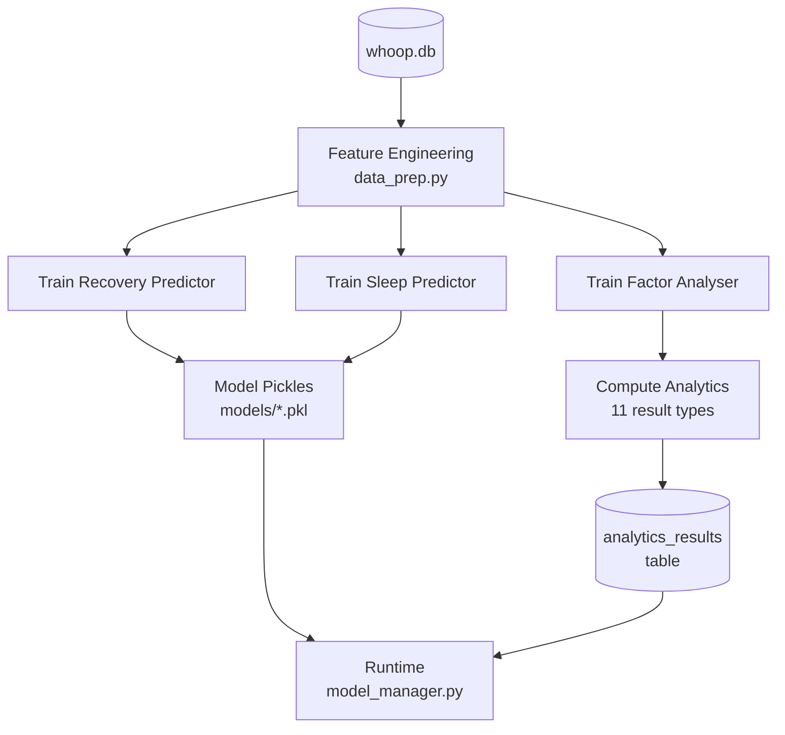

# Pipelines

Batch processing pipelines that train ML models and pre-compute analytics
results. These run offline (not during API requests) and store their outputs
for instant retrieval by services and API endpoints.

## Analytics Pipeline

The main pipeline (`analytics_pipeline.py`) runs in two phases:



### Phase 1: Model Training

| Model | Target | Key Features | Output |
|---|---|---|---|
| **Recovery Predictor** | `recovery_score` | HRV, RHR, SpO2, sleep hours/stages/efficiency, strain, rolling 7-day averages, lagged values, bedtime consistency, sleep need adequacy, actionability flags | `models/recovery_predictor.pkl` |
| **Sleep Predictor** | `sleep_efficiency_percentage` | Total sleep, REM/SWS hours, awake time, bedtime hour, respiratory rate, previous strain/recovery, sleep debt, disturbances | `models/sleep_predictor.pkl` |
| **Factor Analyser** | Feature importance rankings | Same expanded feature set as recovery predictor | Used in-memory for downstream analytics |

### Phase 2: Analytics Computation

All results are stored as JSON in the `analytics_results` SQLite table,
keyed by `(result_type, days_back)`.

| Result Type | Description |
|---|---|
| `factor_importance` | Ranked factors affecting recovery with percentage contributions |
| `sleep_factors` | Ranked factors affecting sleep quality |
| `recovery_deep_dive` | Detailed recovery patterns by category (green/yellow/red) |
| `correlations` | Pairwise metric correlations with strength ratings |
| `correlation_matrix` | Full correlation matrix across all features |
| `recovery_mlr` | Multiple linear regression model for recovery |
| `hrv_mlr` | Multiple linear regression model for HRV |
| `recovery_actionability` | Threshold-based rules mapping behaviours to recovery outcomes |
| `insights` | Pre-generated natural language insight summaries |
| `trends` | Time series trend detection (recovery, HRV, RHR, sleep) |
| `summary` | Pipeline execution summary with model accuracies |

## Running the Pipeline

```bash
# Via make target
make analytics

# Directly
uv run python -m whoopdata.pipelines.analytics_pipeline

# Custom history window
uv run python -c "
from whoopdata.pipelines.analytics_pipeline import AnalyticsPipeline
pipeline = AnalyticsPipeline(days_back=180)
pipeline.run()
"
```

The pipeline requires at least 50 recovery records with 14+ consecutive days
of history for rolling feature computation. It prints a rich progress display
and summary of trained models, computed analytics, and any errors.

## Dependencies

The pipeline uses modules from `whoopdata/analytics/`:

- `data_prep.py` -- feature engineering (rolling averages, lagged values,
  sleep architecture metrics, actionability flags)
- `models.py` -- `RecoveryPredictor` and `SleepPredictor` (XGBoost wrappers)
- `engine.py` -- analysis engines (factor importance, correlations, deep
  dive, insights, time series)
- `mlr.py` -- multiple linear regression models
- `recovery_actionability.py` -- threshold-based actionability rules
- `results_loader.py` -- reads stored results from `analytics_results` table
- `model_manager.py` -- loads trained model pickles for runtime use
