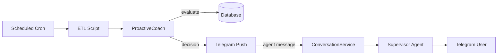

# Services

Domain logic that sits between the API/agent layer and the database. Services
orchestrate CRUD operations, external API calls, and analytics into
higher-level capabilities.

## Module Map

| Module | Responsibility |
|---|---|
| `proactive_coach.py` | Evaluates whether to send an unsolicited coaching nudge. Implements a rule-based decision engine with cooldown tracking, intent classification (morning briefing, stress check-in, activity adherence, measurement freshness, barrier resolution), and evidence gathering. Dispatched by `scripts/scheduled_proactive.py`. |
| `weakness_reminder.py` | Parses a user-maintained `weakness.md` file into individual reflection points and selects one per day using a stable-random rotation. Builds a prompt for the agent to deliver as a coaching nudge. Dispatched by `scripts/scheduled_weakness.py`. |
| `recovery_actionability_service.py` | Composes a recovery actionability snapshot combining current state (recovery, sleep, strain, HRV, RHR), a baseline ML prediction, optional scenario-adjusted prediction, and ranked adjustment levers. Powers the daily insights endpoint and the agent's recovery tool. |
| `daily_engine.py` | Generates the daily coaching briefing by aggregating recovery, sleep, workout, and environmental data into a structured context object that the agent or API can render. |
| `dashboard_service.py` | Builds the dashboard payload: multi-day recovery trends, sleep summaries, workout history, and body composition data for the web UI. |
| `health_metrics_service.py` | Unified access layer for health metrics across WHOOP and Withings. Normalises and merges data from both sources for downstream consumers. |
| `guidance_service.py` | Produces evidence-based guidance text (e.g. sleep hygiene tips, strain management) based on current recovery state and historical patterns. |
| `insight_context_service.py` | Assembles the context object passed to insight-generating prompts -- collects recent data, trends, and user profile information. |
| `scenario_planner.py` | Runs what-if predictions: given modified inputs (e.g. "what if I slept 8 hours instead of 6?"), produces a predicted recovery score with confidence intervals. Used by `recovery_actionability_service`. |
| `adherence_tracker.py` | Tracks whether the user is following committed plans (exercise frequency, consistency streaks) and flags gaps for proactive nudges. |
| `lifecycle.py` | Application startup and shutdown hooks -- initialises database connections, persistence resources, and scheduled task registration. |
| `personas.py` | Defines coaching persona variants (tone, style) that can be applied to agent responses. |
| `weather_service.py` | Fetches current weather and forecasts from OpenWeatherMap. Used by the environment specialist and proactive coach. |
| `tide_service.py` | Fetches Thames tide times for riverside walk recommendations. |
| `transport_service.py` | Fetches TfL line status for commute-aware coaching. |

## Proactive Coaching Flow

The proactive system runs on a schedule (via launchd plists). After ETL
completes, the proactive coach evaluates whether a nudge is warranted based
on cooldowns, time windows, and health data triggers. If a nudge fires, it
is sent through the normal conversation service so the supervisor controls
the final tone and the exchange appears in the conversation thread.

## Weakness Reminder Flow

A separate scheduled job picks a weakness point from `weakness.md`, builds a
reflection prompt, and sends it through the same Telegram push path. This
encourages daily self-reflection on user-identified areas for improvement.
